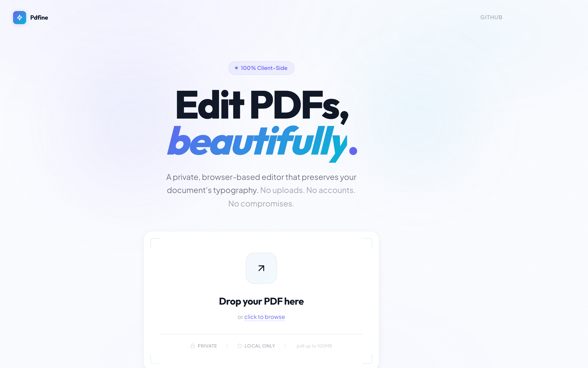

<div align="center">

<br />

<pre>
██████╗ ██████╗ ███████╗██╗███╗   ██╗███████╗
██╔══██╗██╔══██╗██╔════╝██║████╗  ██║██╔════╝
██████╔╝██║  ██║█████╗  ██║██╔██╗ ██║█████╗  
██╔═══╝ ██║  ██║██╔══╝  ██║██║╚██╗██║██╔══╝  
██║     ██████╔╝██║     ██║██║ ╚████║███████╗
╚═╝     ╚═════╝ ╚═╝     ╚═╝╚═╝  ╚═══╝╚══════╝
</pre>

**Edit PDFs directly in the browser — typography preserved, privacy guaranteed.**

All parsing, editing, reflow, and export happen 100% client-side.
<br />No uploads. No accounts. No backend.

<br />

[](https://12og3r.github.io/Pdfine/)

[](.)
[](.)
[](.)

<br />

[](./LICENSE)
[](.)
[](.)
[](.)

<br />

</div>

---

<br />

## ✦ Showcase

<p align="center">
  
  <br />
  <sub>Clean, luminous landing with animated gradient orbs, 3D tilt upload widget, and shine-sweep hover effect</sub>
</p>

<br />

## ✦ Why Pdfine?

<table>
<tr>
<td width="33%" valign="top">

### 🔒 Truly Private

Your files **never leave your device**. All parsing, editing, and exporting happen entirely in the browser. No server. No telemetry. Nothing leaves localhost.

</td>
<td width="33%" valign="top">

### 🔤 Typography Preserved

Edit text while keeping the **original fonts, sizes, weights, and colors** intact. Automatic text reflow with PDF-native line heights and per-line character widths — text stays exactly where it was.

</td>
<td width="33%" valign="top">

### ⚡ Zero Setup

No accounts. No installations. No backend to deploy. Open the page, drop a PDF, start editing. That's it.

</td>
</tr>
</table>

<table>
<tr>
<td width="33%" valign="top">

### 🎯 Pixel-Perfect

Canvas-based rendering with **character-level precision**. What you see is exactly what you get in the exported PDF.

</td>
<td width="33%" valign="top">

### ✂️ Full Editing

Cursor navigation, text selection, copy/paste, **undo/redo**, IME input (CJK), and keyboard shortcuts. Enter to confirm, Shift+Enter for new lines, Escape to cancel.

</td>
<td width="33%" valign="top">

### 📦 One-Click Export

Save your edits as a new PDF with **embedded fonts**, preserving the original document structure and visual fidelity.

</td>
</tr>
</table>

<br />

## ✦ Tech Stack

```
┌─────────────────────────────────────────────────────────────┐
│                                                             │
│   ┌──────────┐  ┌──────────┐  ┌──────────┐  ┌──────────┐  │
│   │ React 19 │  │   TS 5.9 │  │  Vite 7  │  │Zustand 5 │  │
│   └────┬─────┘  └────┬─────┘  └────┬─────┘  └────┬─────┘  │
│        │              │             │              │        │
│   ┌────┴──────────────┴─────────────┴──────────────┴────┐   │
│   │               Canvas Rendering Engine               │   │
│   └────┬──────────────┬─────────────┬───────────────────┘   │
│        │              │             │                       │
│   ┌────┴─────┐  ┌─────┴────┐  ┌────┴─────┐                │
│   │ pdfjs-   │  │  pdf-lib  │  │ opentype │                │
│   │ dist     │  │          │  │   .js    │                │
│   │ (parse)  │  │ (export) │  │ (fonts)  │                │
│   └──────────┘  └──────────┘  └──────────┘                │
│                                                             │
│   Tailwind CSS 4  ·  Vitest  ·  Playwright  ·  ESLint 9    │
│                                                             │
└─────────────────────────────────────────────────────────────┘
```

<br />

## ✦ Getting Started

### Prerequisites

- **Node.js** >= 18
- **pnpm** (recommended) or npm

### Install & Run

```bash
# Clone
git clone https://github.com/12og3r/Pdfine.git && cd Pdfine

# Install dependencies
pnpm install

# Start dev server
pnpm dev
```

Open **http://localhost:5173** — drop a PDF and start editing.

> **Live demo**: [12og3r.github.io/Pdfine](https://12og3r.github.io/Pdfine/)

### Build

```bash
pnpm build         # Production build → dist/
pnpm preview       # Preview locally
```

### Test

```bash
pnpm test           # Unit tests
pnpm test:watch     # Watch mode
npx playwright test # E2E (Chromium)
```

<br />

## ✦ Architecture

```
User types → hidden <textarea> → InputHandler → EditCommand
  → CommandHistory (undo/redo) → DocumentModel update
  → EventBus 'textChanged' → LayoutEngine reflow
  → RenderEngine re-render → Canvas update
```

<details>
<summary><strong>Module overview</strong></summary>

<br />

```
src/core/
├── EditorCore.ts          # Central orchestrator — wires all modules
├── parser/                # PDF parsing, text block extraction
├── model/                 # Document data model (outside React state)
├── layout/                # Text reflow, Greedy + Knuth-Plass line breaking
├── render/                # Canvas rendering pipeline, hit testing
├── editor/                # Input handling, IME, cursor, selection, undo/redo
├── font/                  # Font extraction, metrics, fallback chain
├── export/                # PDF export with white overlay + redraw strategy
├── infra/                 # EventBus, CoordinateTransformer, Logger
└── interfaces/            # I-prefixed contracts for all modules
```

</details>

<details>
<summary><strong>Key design decisions</strong></summary>

<br />

| Decision | Rationale |
|----------|-----------|
| Document model lives outside React | Real-time editing performance (100+ updates/sec) |
| Typed EventBus for module communication | Decoupled modules, no circular dependencies |
| Hidden `<textarea>` for input capture | Industry pattern (Google Docs, VS Code) for keyboard + IME |
| Canvas rendering (not DOM) | Character-level positioning precision |
| White overlay export strategy | Simplicity over PDF content stream editing |

</details>

<br />

## ✦ Deploy

Pdfine is a **fully static site** — no backend, no env vars. Deploy anywhere:

```
                    ┌──────────────┐
   pnpm build ───▶ │    dist/     │ ───▶  Any static host
                    └──────────────┘
```

| Platform | How |
|----------|-----|
| **Vercel** | `vercel --prod` |
| **Netlify** | Connect repo or drag `dist/` |
| **GitHub Pages** | Push `dist/` to `gh-pages` |
| **Cloudflare Pages** | Build: `pnpm build`, output: `dist` |
| **Docker** | `COPY dist/ /usr/share/nginx/html/` |

<br />

## ✦ Contributing

Contributions are welcome! Please open an issue first to discuss what you'd like to change.

```bash
# Development workflow
pnpm dev          # Start dev server
pnpm test:watch   # Run tests in watch mode
pnpm lint         # Lint before committing
```

<br />

## ✦ License

This project is licensed under the **GNU General Public License v3.0** — see the [LICENSE](./LICENSE) file for details.

You are free to use, modify, and distribute this software, provided that any derivative work is also distributed under the same license.

<br />

---

<div align="center">
<sub>Built with care. Your PDFs stay yours.</sub>
</div>
